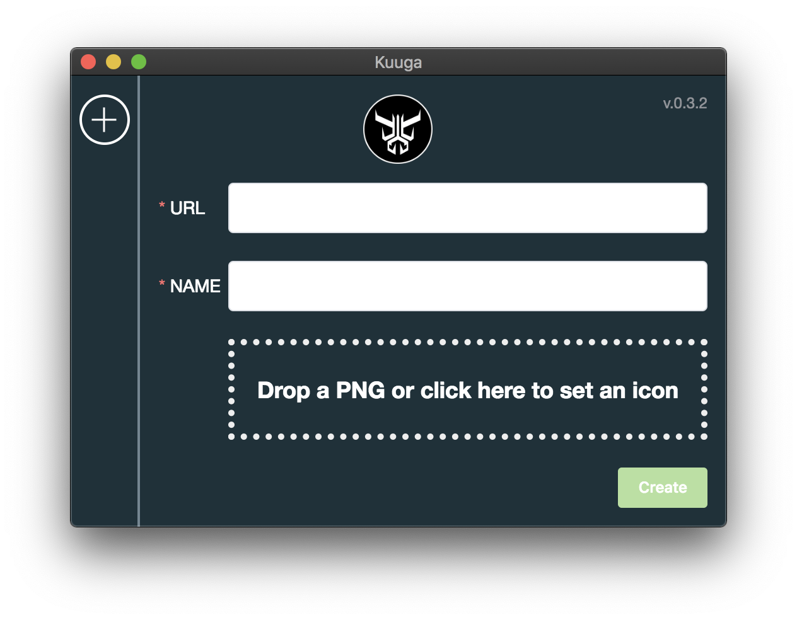

[Download (MacOS)](https://github.com/jrainlau/kuuga/releases/download/0.4.2/Kuuga-darwin-x64.zip)

[Download (Windows)](https://github.com/jrainlau/kuuga/releases/download/0.4.2/Kuuga-win32-x64.zip)

# Kuuga

`Kuuga` is a tool for converting any *Web Apps* to *Desktop Apps*.

The name was inspired by *Kamen Rider Kuuga*, who is a hero for guarding everyone's smile, and switches to different abilities to fight in different situations.

In this tool, it switches itself to different *Desktop Apps* bases on the given url, such as our hero fighting with different enemies.

## Usage

Once opening `Kuuga.app`, you will see a very concise interface, which contains only two input box and a button, that's it! Now let's convert a web site to a desktop app.



All you need to do is to paste a web site url and type the name of it, besides you could drop a PNG as the app's icon. Then click "Create".


Look, Youtube opens in a native window, now it's one of your desktop app, too.

It's convenience to you to manage all your apps. Look at the gif below, hovering the mouse above the icon for edit mode, and click the icon to open the app. What's more, you could switch the apps from the status bar very easily.


This is all the usage of `Kuuga`, just run and enjoy it!

## Development

`Kuuga` was built in `Electron` and `VueJS`. For developer, follow the steps below to run `Kuuga` in your own mechine.

1. Clone the project:
    ```
    git clone https://github.com/jrainlau/kuuga.git
    ```

2. Install dependencies:
    ```
    cd kuuga && npm install
    ```

3. Run the render process and the main process separately:
    ```
    npm run serve
    ```

    ```
    npm run electron:dev
    ```

Before releasing, you should run `build` command in first:

```
npm run build
```

A folder names `/release` with all the app's code, has been output to the root directory.

Then check whether the app is running good or not:
```
npm run electron:build
```

If everything goes fine, package it as a `.app` application!

```
# for MacOS
npm run pack:mac

# for Windows
npm run pack:win
```

## License
MIT